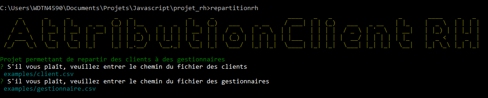

# Introduction

RepartitionRH est une application permettant de repartir aléatoirement des clients à des gestionnaires. Les règles de répartitions sont assez simples.

- Attribuer à chaque client deux gestionnaires distincts
- Le nombre de client doit être supérieur aux nombres de gestionnaires

## Installation

```bash
$ npm i -g repartition-rh
```

## Utilisation

Pour utiliser l'application il suffit d'exécuter la commande suivante,

```bash
$ repartitionrh
```

Puis vous devez renseigner les différents éléments suivants :

- Le chemin du fichier contenant les clients
- Le chemin du fichier contenant les gestionnaires

<p align="center">
  
</p>

Le résultat de l'opération est disponible dans le dossier courant
